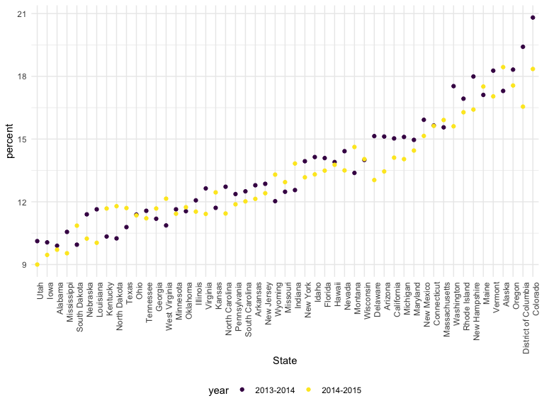
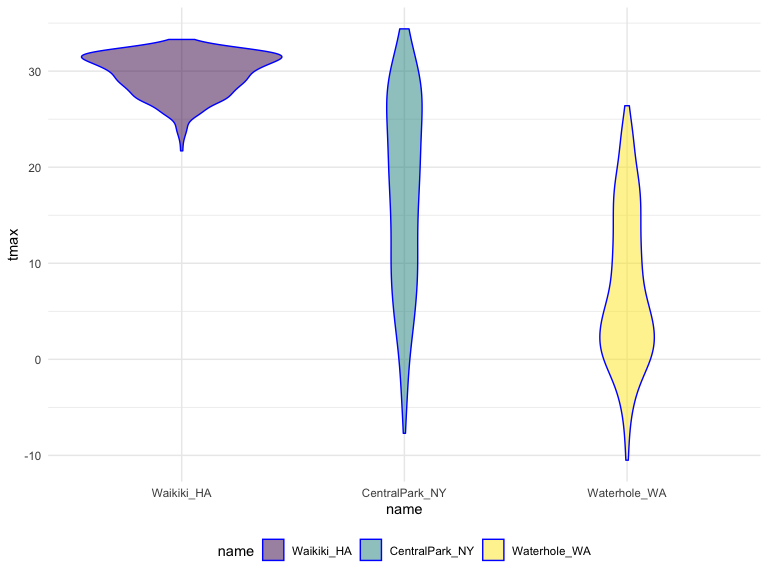
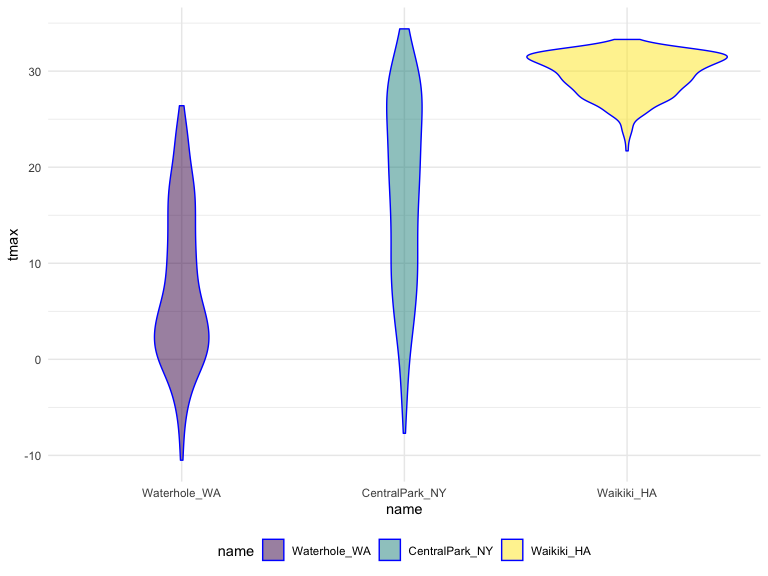
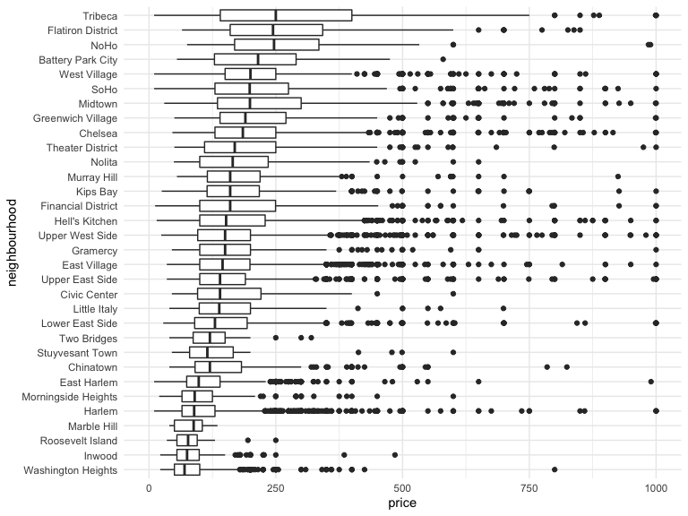
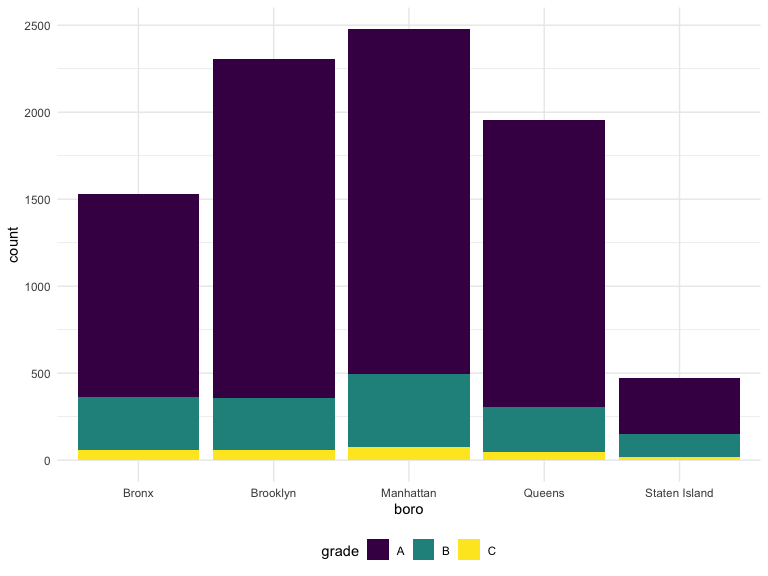
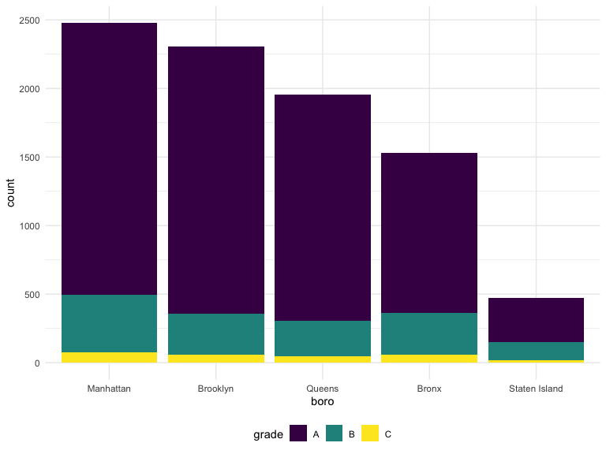
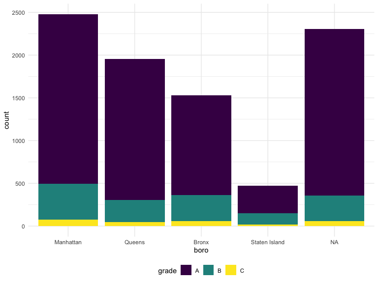

Reading\_data
================
Weijia Xiong
10/15/2019

``` r
string_vec = c("my", "name", "is", "jeff")
str_detect(string_vec, "jeff")
```

    ## [1] FALSE FALSE FALSE  TRUE

``` r
str_detect(string_vec, "je")  # not full
```

    ## [1] FALSE FALSE FALSE  TRUE

``` r
str_replace(string_vec, "jeff", "Jeff")
```

    ## [1] "my"   "name" "is"   "Jeff"

``` r
str_replace(string_vec, "m","M")
```

    ## [1] "My"   "naMe" "is"   "jeff"

``` r
string_vec = c(
  "i think we all rule for participating",
  "i think i have been caught",
  "i think this will be quite fun actually",
  "it will be fun, i think"
  )
string_vec
```

    ## [1] "i think we all rule for participating"  
    ## [2] "i think i have been caught"             
    ## [3] "i think this will be quite fun actually"
    ## [4] "it will be fun, i think"

``` r
str_detect(string_vec, "^i think") #^ begin
```

    ## [1]  TRUE  TRUE  TRUE FALSE

``` r
str_detect(string_vec, "i think$") #end $
```

    ## [1] FALSE FALSE FALSE  TRUE

``` r
string_vec = c(
  "Y'all remember Pres. HW Bush?",
  "I saw a green bush",
  "BBQ and Bushwalking at Molonglo Gorge",
  "BUSH -- LIVE IN CONCERT!!"
  )

str_detect(string_vec,"[Bb]ush") # 大小写都可以
```

    ## [1]  TRUE  TRUE  TRUE FALSE

a range of letters or numbers that count as a match

``` r
string_vec = c(
  '7th inning stretch',
  '1st half soon to begin. Texas won the toss.',
  'she is 5 feet 4 inches tall',
  '3AM - cant sleep :('
  )

str_detect(string_vec, "^[0-9][a-zA-Z]")
```

    ## [1]  TRUE  TRUE FALSE  TRUE

The character . matches anything.

``` r
string_vec = c(
  'Its 7:11 in the evening',
  'want to go to 7-11?',
  'my flight is AA711',
  'NetBios: scanning ip 203.167.114.66'
  )

str_detect(string_vec, "7.11")
```

    ## [1]  TRUE  TRUE FALSE  TRUE

Special characters

``` r
string_vec = c(
  'The CI is [2, 5]',
  ':-]',
  ':-[',
  'I found the answer on pages [6-7]',
  'wgewl \''
  )
str_detect(string_vec, "\\[") # special to regular 
```

    ## [1]  TRUE FALSE  TRUE  TRUE FALSE

``` r
string_vec = c(
  "The CI is w \'s gew",
  ':-]',
  ':-[',
  'I found the answer on pages [6-7]',
  'wgewl \''
  )

str_detect(string_vec, " ") # special to regular 
```

    ## [1]  TRUE FALSE FALSE  TRUE  TRUE

``` r
a  = "Men's shoes"
b = sub("'","\\\\'",a)
print(b)
```

    ## [1] "Men\\'s shoes"

``` r
cat(b)
```

    ## Men\'s shoes

``` r
nchar(b) 
```

    ## [1] 12

``` r
pulse_data = 
  haven::read_sas("./data/public_pulse_data.sas7bdat") %>%
  janitor::clean_names() %>%
  pivot_longer(
    bdi_score_bl:bdi_score_12m,
    names_to = "visit", 
    names_prefix = "bdi_score_",
    values_to = "bdi") %>%
  select(id, visit, everything()) %>%
  mutate(
    visit = str_replace(visit, "bl", "00m"),
    visit = fct_relevel(visit, str_c(c("00", "01", "06", "12"), "m"))) %>%
  arrange(id, visit)

print(pulse_data, n = 12)
```

    ## # A tibble: 4,348 x 5
    ##       id visit   age sex     bdi
    ##    <dbl> <fct> <dbl> <chr> <dbl>
    ##  1 10003 00m    48.0 male      7
    ##  2 10003 01m    48.0 male      1
    ##  3 10003 06m    48.0 male      2
    ##  4 10003 12m    48.0 male      0
    ##  5 10015 00m    72.5 male      6
    ##  6 10015 01m    72.5 male     NA
    ##  7 10015 06m    72.5 male     NA
    ##  8 10015 12m    72.5 male     NA
    ##  9 10022 00m    58.5 male     14
    ## 10 10022 01m    58.5 male      3
    ## 11 10022 06m    58.5 male      8
    ## 12 10022 12m    58.5 male     NA
    ## # … with 4,336 more rows

web
data

``` r
nsduh_url = "http://samhda.s3-us-gov-west-1.amazonaws.com/s3fs-public/field-uploads/2k15StateFiles/NSDUHsaeShortTermCHG2015.htm"

table_marj = 
  read_html(nsduh_url) %>% 
  html_nodes(css = "table") %>% 
  .[[1]] %>%
  html_table() %>%
  slice(-1) %>%  # remove the first row
  as_tibble()
```

``` r
data_marj =
table_marj %>% 
  select(-contains("P Value")) %>% 
  pivot_longer(
    -State,
    names_to = "age_year",
    values_to = "percent"
  ) %>% 
  separate(age_year, into = c("age","year"),sep = "\\(") %>% 
  mutate(
    year = str_replace(year, "\\)",""),
    percent = str_replace(percent, "[a-c]$",""),
    percent = as.numeric(percent)
  ) %>% 
  filter(!(State %in% c("Total U.S.", "Northeast", "Midwest", "South", "West")))
```

``` r
data_marj %>%
  filter(age == "12-17") %>% 
  mutate(State = fct_reorder(State, percent)) %>% 
  ggplot(aes(x = State, y = percent, color = year)) + 
    geom_point() + 
    theme(axis.text.x = element_text(angle = 90, hjust = 1))
```



``` r
url_base = "https://www.amazon.com/product-reviews/B00005JNBQ/ref=cm_cr_arp_d_viewopt_rvwer?ie=UTF8&reviewerType=avp_only_reviews&sortBy=recent&pageNumber="

urls = str_c(url_base, 1:5)

read_html(urls[1]) %>% 
  html_nodes("#cm_cr-review_list .review-title") %>%
  html_text()
```

    ##  [1] "Give me some of your tots\n            "           
    ##  [2] "Nostalgic\n            "                           
    ##  [3] "Make you giggle type movie\n            "          
    ##  [4] "This movie is so stupid.\n            "            
    ##  [5] "Hilarious\n            "                           
    ##  [6] "Waste of money\n            "                      
    ##  [7] "Good movie\n            "                          
    ##  [8] "A classic\n            "                           
    ##  [9] "FRIKKEN SWEET MOVIE, GAWSH.\n            "         
    ## [10] "You gonna eat the rest of your tots?\n            "

``` r
read_html(urls[2]) %>% 
  html_nodes("#cm_cr-review_list .review-title") %>%
  html_text()
```

    ##  [1] "Tina you fat lard come get some dinner!\n            "
    ##  [2] "Great family movie\n            "                     
    ##  [3] "Teens love it\n            "                          
    ##  [4] "Great\n            "                                  
    ##  [5] "Great Movie, Bad Packaging\n            "             
    ##  [6] "jeez napoleon\n            "                          
    ##  [7] "\U0001f44d\n            "                             
    ##  [8] "A classic!\n            "                             
    ##  [9] "A must own\n            "                             
    ## [10] "If you like 80s ...you must watch\n            "

``` r
vec_sex = factor(c("male", "male", "female", "female"))
vec_sex
```

    ## [1] male   male   female female
    ## Levels: female male

``` r
as.numeric(vec_sex)
```

    ## [1] 2 2 1 1

``` r
vec_sex = relevel(vec_sex, ref = "male")
vec_sex
```

    ## [1] male   male   female female
    ## Levels: male female

``` r
as.numeric(vec_sex)
```

    ## [1] 1 1 2 2

``` r
weather_df = 
  rnoaa::meteo_pull_monitors(
    c("USW00094728", "USC00519397", "USS0023B17S"),
    var = c("PRCP", "TMIN", "TMAX"), 
    date_min = "2017-01-01",
    date_max = "2017-12-31") %>%
  mutate(
    name = recode(id, USW00094728 = "CentralPark_NY", 
                      USC00519397 = "Waikiki_HA",
                      USS0023B17S = "Waterhole_WA"),
    tmin = tmin / 10,
    tmax = tmax / 10) %>%
  select(name, id, everything())
```

    ## Registered S3 method overwritten by 'crul':
    ##   method                 from
    ##   as.character.form_file httr

    ## Registered S3 method overwritten by 'hoardr':
    ##   method           from
    ##   print.cache_info httr

    ## file path:          /Users/osukuma/Library/Caches/rnoaa/ghcnd/USW00094728.dly

    ## file last updated:  2019-09-03 10:46:14

    ## file min/max dates: 1869-01-01 / 2019-08-31

    ## file path:          /Users/osukuma/Library/Caches/rnoaa/ghcnd/USC00519397.dly

    ## file last updated:  2019-09-03 10:46:22

    ## file min/max dates: 1965-01-01 / 2019-08-31

    ## file path:          /Users/osukuma/Library/Caches/rnoaa/ghcnd/USS0023B17S.dly

    ## file last updated:  2019-09-03 10:46:25

    ## file min/max dates: 1999-09-01 / 2019-08-31

``` r
weather_df %>%
  mutate(name = forcats::fct_relevel(name, c("Waikiki_HA", "CentralPark_NY", "Waterhole_WA"))) %>%  # order!
  ggplot(aes(x = name, y = tmax)) + 
  geom_violin(aes(fill = name), color = "blue", alpha = .5) + 
  theme(legend.position = "bottom")
```



``` r
weather_df %>%
  mutate(name = forcats::fct_reorder(name, tmax)) %>%  #order by tmax 从小到大
  ggplot(aes(x = name, y = tmax)) + 
  geom_violin(aes(fill = name), color = "blue", alpha = .5) + 
  theme(legend.position = "bottom")
```



``` r
weather_df %>%
  lm(tmax ~ name, data = .)
```

    ## 
    ## Call:
    ## lm(formula = tmax ~ name, data = .)
    ## 
    ## Coefficients:
    ##      (Intercept)    nameWaikiki_HA  nameWaterhole_WA  
    ##           17.366            12.291            -9.884

``` r
weather_df %>%
  mutate(name = forcats::fct_relevel(name, c("Waikiki_HA", "CentralPark_NY", "Waterhole_WA"))) %>% 
  lm(tmax ~ name, data = .)
```

    ## 
    ## Call:
    ## lm(formula = tmax ~ name, data = .)
    ## 
    ## Coefficients:
    ##        (Intercept)  nameCentralPark_NY    nameWaterhole_WA  
    ##              29.66              -12.29              -22.18

``` r
data("nyc_airbnb")

nyc_airbnb %>%
  filter(neighbourhood_group == "Manhattan") %>% 
  mutate(
    neighbourhood = fct_reorder(neighbourhood, price, na.rm = TRUE)) %>% 
  ggplot(aes(x = neighbourhood, y = price)) +
  geom_boxplot() +
  coord_flip() + 
  ylim(0, 1000)
```



``` r
data("rest_inspec")

rest_inspec %>% 
  group_by(boro, grade) %>% 
  summarize(n = n()) %>% 
  spread(key = grade, value = n)
```

    ## # A tibble: 6 x 8
    ## # Groups:   boro [6]
    ##   boro              A     B     C `Not Yet Graded`     P     Z `<NA>`
    ##   <chr>         <int> <int> <int>            <int> <int> <int>  <int>
    ## 1 BRONX         13688  2801   701              200   163   351  16833
    ## 2 BROOKLYN      37449  6651  1684              702   416   977  51930
    ## 3 MANHATTAN     61608 10532  2689              765   508  1237  80615
    ## 4 Missing           4    NA    NA               NA    NA    NA     13
    ## 5 QUEENS        35952  6492  1593              604   331   913  45816
    ## 6 STATEN ISLAND  5215   933   207               85    47   149   6730

``` r
rest_inspec =
  rest_inspec %>%
  filter(grade %in% c("A", "B", "C"), boro != "Missing") %>% 
  mutate(boro = str_to_title(boro))

rest_inspec %>% 
  filter(str_detect(dba, "Pizza")) %>% 
  group_by(boro, grade) %>% 
  summarize(n = n()) %>% 
  spread(key = grade, value = n)
```

    ## # A tibble: 5 x 3
    ## # Groups:   boro [5]
    ##   boro              A     B
    ##   <chr>         <int> <int>
    ## 1 Bronx             9     3
    ## 2 Brooklyn          6    NA
    ## 3 Manhattan        26     8
    ## 4 Queens           17    NA
    ## 5 Staten Island     5    NA

``` r
x = factor(c(rep("A",5),rep("B",8)))
y = rnorm(13)
lmm = lm(y~x)
lmm
```

    ## 
    ## Call:
    ## lm(formula = y ~ x)
    ## 
    ## Coefficients:
    ## (Intercept)           xB  
    ##      0.8050      -0.3592

``` r
data("rest_inspec")

rest_inspec %>% 
  group_by(boro, grade) %>% 
  summarize(n = n()) %>% 
  spread(key = grade, value = n)
```

    ## # A tibble: 6 x 8
    ## # Groups:   boro [6]
    ##   boro              A     B     C `Not Yet Graded`     P     Z `<NA>`
    ##   <chr>         <int> <int> <int>            <int> <int> <int>  <int>
    ## 1 BRONX         13688  2801   701              200   163   351  16833
    ## 2 BROOKLYN      37449  6651  1684              702   416   977  51930
    ## 3 MANHATTAN     61608 10532  2689              765   508  1237  80615
    ## 4 Missing           4    NA    NA               NA    NA    NA     13
    ## 5 QUEENS        35952  6492  1593              604   331   913  45816
    ## 6 STATEN ISLAND  5215   933   207               85    47   149   6730

``` r
rest_inspec =
  rest_inspec %>%
  filter(grade %in% c("A", "B", "C"), boro != "Missing") %>% 
  mutate(boro = str_to_title(boro))
```

``` r
rest_inspec %>% 
  filter(str_detect(dba, "Pizza")) %>% 
  group_by(boro, grade) %>% 
  summarize(n = n()) %>% 
  spread(key = grade, value = n)
```

    ## # A tibble: 5 x 3
    ## # Groups:   boro [5]
    ##   boro              A     B
    ##   <chr>         <int> <int>
    ## 1 Bronx             9     3
    ## 2 Brooklyn          6    NA
    ## 3 Manhattan        26     8
    ## 4 Queens           17    NA
    ## 5 Staten Island     5    NA

``` r
rest_inspec %>% 
  filter(str_detect(dba, "[Pp][Ii][Zz][Zz][Aa]")) %>% 
  group_by(boro, grade) %>% 
  summarize(n = n()) %>% 
  spread(key = grade, value = n)
```

    ## # A tibble: 5 x 4
    ## # Groups:   boro [5]
    ##   boro              A     B     C
    ##   <chr>         <int> <int> <int>
    ## 1 Bronx          1170   305    56
    ## 2 Brooklyn       1948   296    61
    ## 3 Manhattan      1983   420    76
    ## 4 Queens         1647   259    48
    ## 5 Staten Island   323   127    21

``` r
rest_inspec %>% 
  filter(str_detect(dba, "[Pp][Ii][Zz][Zz][Aa]")) %>%
  ggplot(aes(x = boro, fill = grade)) + 
  geom_bar() 
```



``` r
rest_inspec %>% 
  filter(str_detect(dba, "[Pp][Ii][Zz][Zz][Aa]")) %>%
  mutate(boro = fct_infreq(boro)) %>%  ##order
  ggplot(aes(x = boro, fill = grade)) + 
  geom_bar() 
```



``` r
##don't work
rest_inspec %>% 
  filter(str_detect(dba, "[Pp][Ii][Zz][Zz][Aa]")) %>%
  mutate(
    boro = fct_infreq(boro),
    boro = replace(boro, which(boro == "Brooklyn"), "HipsterHQ")) %>%
  ggplot(aes(x = boro, fill = grade)) + 
  geom_bar() + 
  scale_fill_viridis(discrete = TRUE)
```



``` r
##correct
rest_inspec %>% 
  filter(str_detect(dba, "[Pp][Ii][Zz][Zz][Aa]")) %>%
  mutate(
    boro = fct_infreq(boro),
    boro = str_replace(boro, "Brooklyn", "HipsterHQ")) %>%
  ggplot(aes(x = boro, fill = grade)) + 
  geom_bar() 
```


``` r
rest_inspec %>% 
  filter(str_detect(dba, regex("pizza", ignore_case = TRUE))) %>%
  mutate(
    boro = fct_infreq(boro),
    boro = fct_recode(boro, "HipsterHQ" = "Brooklyn")) %>%
  ggplot(aes(x = boro, fill = grade)) + 
  geom_bar() + 
  scale_fill_viridis(discrete = TRUE)
```


